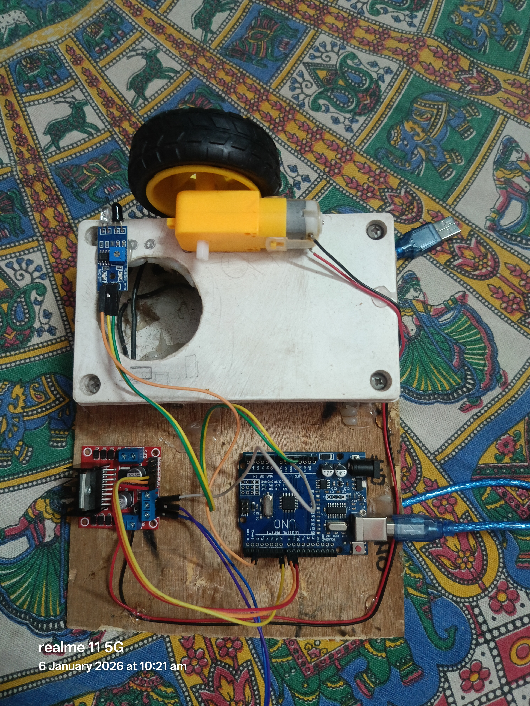
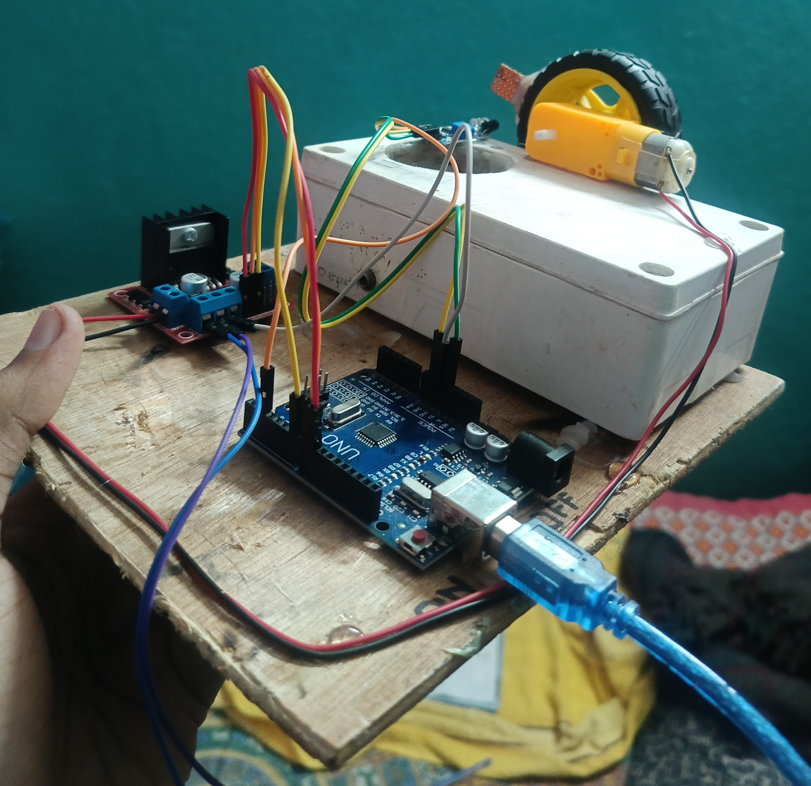
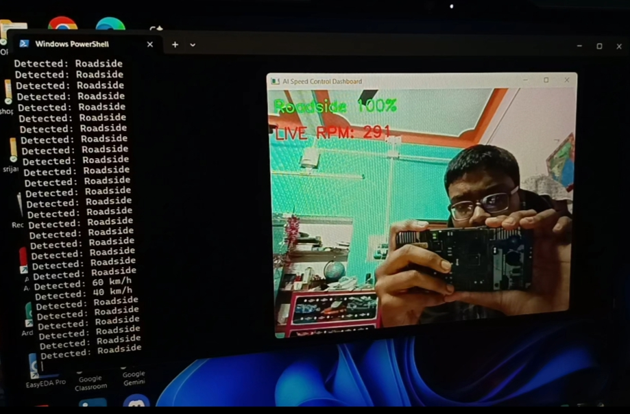

# AI_powered_Smart_Speed_Governance_and_Safety_System
An AI-based speed limit detection and automatic speed control system using computer vision and embedded electronics. A TFLite model detects road signs via camera, Python processes data, and Arduino controls motor speed with real-time RPM feedback for safer driving.

## Detailed Description : 
This project presents an AI-based speed limit detection and automatic speed control system that integrates machine learning, computer vision, and embedded electronics. A camera continuously captures real-time road visuals, which are processed by a Python application using OpenCV. A TensorFlow Lite (TFLite) model is used to detect speed limit signs such as 40 and 60 from the live video feed.
Based on the detected speed limit, the Python program sends control commands to an Arduino via serial communication. The Arduino adjusts the motor speed using a motor driver to match the detected speed limit. An IR sensor mounted near the wheel measures RPM in real time, enabling feedback-based speed regulation.
If no speed sign is detected for a defined time period, the system automatically returns to a default cruising speed. This approach demonstrates a practical driver-assistance concept aimed at reducing human error and improving road safety.

## Technologies Used:
-Python
-OpenCV
-TensorFlow Lite
-Arduino Uno
-IR Sensor
-Motor Driver
## 🔄 System Flowchart

The flowchart below shows the complete working process of the project, 
from camera input to motor speed control.

### Flow Explanation
1. Camera captures real-time road images.
2. Python detects speed limit signs using a TFLite model.
3. Detected speed is sent to Arduino via serial communication.
4. Arduino controls motor speed using PWM and IR sensor feedback.
## 🔹 Why This Project is Different from Others

- **Real-Time AI Detection:** Unlike many conventional speed control projects, this system uses a TensorFlow Lite model to detect speed limit signs from a live camera feed, making it dynamic and responsive to real-world conditions.

- **Closed-Loop RPM Feedback:** An IR sensor measures the motor RPM, allowing the Arduino to adjust the motor speed automatically and accurately according to the detected speed limit, which most other projects lack.

- **Full Hardware-Software Integration:** This project combines Python (AI + image processing + serial communication) with Arduino and motor driver hardware, ensuring an end-to-end functional system.

- **Fail-Safe Default Speed:** If no sign is detected for a defined period, the system returns to a normal cruising speed, ensuring safe and consistent operation.

- **Demonstrated on Real Hardware:** Unlike simulation-only projects, this system works on an actual DC motor setup, showing real-time motor speed changes in response to AI-detected speed signs.

- **Practical Driver Assistance:** The combination of AI, real-time feedback, embedded hardware, and fail-safe mechanisms makes this project a unique, practical, and reliable solution for improving road safety.

   
## 🔧 Hardware Implementation

### Complete Hardware Setup

### Arduino and Motor Driver Connection and Motor and IR Sensor for RPM Feedback

The hardware system consists of an Arduino Uno, motor driver, DC motor, IR RPM sensor, and a camera for real-time speed limit detection and control.
  ## 💻 AI Model in Action

The image below shows the Python program running on a laptop while detecting speed limit signs in real-time using the trained TFLite model.

 ## 🌟 Future Enhancements: 

- Detect more speed signs beyond 40 and 60 km/h.
- Vehicle-to-vehicle communication for coordinated driving.
- Upgrade AI model for more accurate detection in complex road conditions.
- Integrate with a mobile app for real-time speed and alerts.
- Implement automatic braking or driver warning for overspeed.
- Connect with IoT/GPS for smart city applications.
## MVP Link: https://drive.google.com/file/d/1T5wWHlUH8yvRRMST0nfJuNSs9h1BSCEN/view?usp=sharing 
## Demo video Link(yt):  https://youtu.be/cnVCr7-kfW4?si=XE4S6ItqduAQGJJV
## OVERVIEW PPT LINK: https://drive.google.com/file/d/1JOvDRLMsXrkApvgmG_pzZO4K9Q7qRe4J/view?usp=sharing
## Explaination PPT LINK : https://docs.google.com/presentation/d/1CQRSeGI408Qp89yjz7XpmMtESwqvTJgJ/edit?usp=drivesdk&ouid=112701685176121377310&rtpof=true&sd=true

## Thank You For Here.
