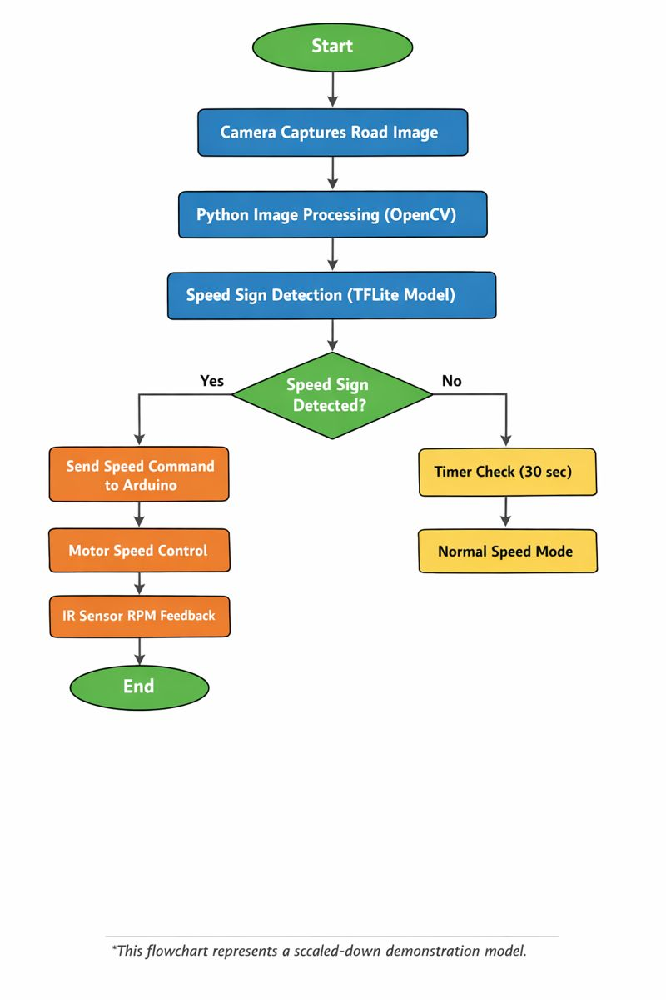

# AI_powered_Smart_Speed_Governance_and_Safety_System
An AI-based speed limit detection and automatic speed control system using computer vision and embedded electronics. A TFLite model detects road signs via camera, Python processes data, and Arduino controls motor speed with real-time RPM feedback for safer driving.

## Detailed Description : 
This project presents an AI-based speed limit detection and automatic speed control system that integrates machine learning, computer vision, and embedded electronics. A camera continuously captures real-time road visuals, which are processed by a Python application using OpenCV. A TensorFlow Lite (TFLite) model is used to detect speed limit signs such as 40 and 60 from the live video feed.
Based on the detected speed limit, the Python program sends control commands to an Arduino via serial communication. The Arduino adjusts the motor speed using a motor driver to match the detected speed limit. An IR sensor mounted near the wheel measures RPM in real time, enabling feedback-based speed regulation.
If no speed sign is detected for a defined time period, the system automatically returns to a default cruising speed. This approach demonstrates a practical driver-assistance concept aimed at reducing human error and improving road safety.

## Technologies Used:
-Python
-OpenCV
-TensorFlow Lite
-Arduino Uno
-IR Sensor
-Motor Driver
## 🔄 System Flowchart

The flowchart below shows the complete working process of the project, 
from camera input to motor speed control.

### Flow Explanation
1. Camera captures real-time road images.
2. Python detects speed limit signs using a TFLite model.
3. Detected speed is sent to Arduino via serial communication.
4. Arduino controls motor speed using PWM and IR sensor feedback.

